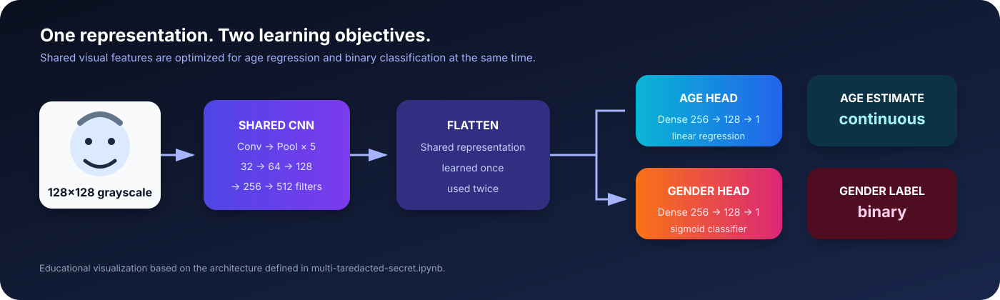
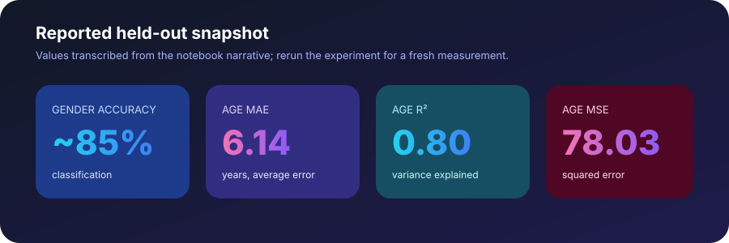

# Multi-Task Face Attribute Estimation

### One face image → two predictions

<em>A compact CNN that learns age regression and binary gender classification from one shared facial representation.</em>

  
  
  
  

> **Research/demo project.** This notebook explores multitask learning on the UTKFace dataset. It is not a biometric identity system, and its outputs should not be used for hiring, access control, profiling, or other high-impact decisions.

## Why this project is interesting

Instead of training two unrelated models, the project shares a convolutional feature extractor between two task-specific heads:

- **Age:** a continuous regression estimate.
- **Gender label:** a binary classification estimate matching the notebook's original labels.

The shared representation lets both objectives learn from the same visual signal while keeping their final predictions independent.

  

## Results at a glance

<table>
  <tr>
    <td align="center"><strong>~85%</strong> gender accuracy</td>
    <td align="center"><strong>6.14</strong> age MAE</td>
    <td align="center"><strong>0.80</strong> age R²</td>
    <td align="center"><strong>78.03</strong> age MSE</td>
  </tr>
</table>

  

<strong>What do these numbers mean?</strong>

The reported classification result is approximately 85% overall accuracy, with the notebook describing roughly 82% performance for the female class and 89% for the male class. For age, the mean absolute error of 6.14 means the average prediction differs from the labeled age by about six years in this experiment. The R² value of 0.80 indicates that the model explains about 80% of the variance in the held-out labels under the notebook's split.

These numbers are a project snapshot, not a benchmark claim. The notebook does not include a fixed random seed for training, a full dataset card, subgroup analysis, or an external test set, so results may change between runs.

## Interactive exploration

The repository includes a browser-friendly dashboard with lightweight interactive charts and metric explanations:

**[Open the interactive metrics dashboard](docs/index.html)**

For the full experiment—including preprocessing, training curves, confusion matrix, ROC curve, age scatter plot, and five sample predictions—open the [notebook](multi-taredacted-secret.ipynb).

<strong>Notebook outputs included in the experiment</strong>

| View | Purpose |
| --- | --- |
| Training curves | Compare train/validation loss, gender accuracy, and age R² across epochs |
| Confusion matrix | Inspect gender-label errors by class |
| ROC curve | Visualize classification discrimination across thresholds |
| Age scatter plot | Compare real age with predicted age against an ideal diagonal |
| Five-image sample | Qualitatively compare labels and predictions on held-out images |

## Data and preprocessing

This project expects the **UTKFace** cropped-image dataset. The notebook reads labels from the image filename convention and uses:

1. `age` as the first underscore-separated filename field.
2. The original binary gender label as the second field.
3. Grayscale conversion and resizing to `128 × 128` pixels.
4. Pixel scaling from `[0, 255]` to `[0, 1]`.
5. An 80/20 train-test split with `random_state=42`.

The dataset is not bundled with this repository. Place the extracted files at `data/utkcropped/utkcropped`, or update the `path` variable in the notebook. Do not commit the dataset or trained weights unless you have the right to redistribute them.

## Model architecture

~~~mermaid
flowchart LR
    A[128×128 grayscale face] --> B[Conv2D 32 + MaxPool]
    B --> C[Conv2D 64 + MaxPool]
    C --> D[Conv2D 128 + MaxPool]
    D --> E[Conv2D 256 + MaxPool]
    E --> F[Conv2D 512 + MaxPool]
    F --> G[Flatten / shared representation]
    G --> H1[Dense 256 → Dense 128]
    G --> H2[Dense 256 → Dense 128]
    H1 --> I[Age output · linear]
    H2 --> J[Gender output · sigmoid]
~~~

The training objective combines binary cross-entropy for the gender head with mean squared error for the age head. Adam is used with a learning rate of `1e-4`, and `ReduceLROnPlateau` lowers the learning rate when validation accuracy stops improving.

## Quick start

### 1. Install dependencies

~~~bash
pip install numpy pandas matplotlib seaborn opencv-python pillow scikit-learn tqdm tensorflow keras pydot
~~~

### 2. Prepare the dataset

Download UTKFace from its authorized source, extract it, and place the cropped images under:

~~~text
data/
└── utkcropped/
    └── utkcropped/
        ├── 1_0_0_20161219140623097.jpg
        ├── ...
~~~

### 3. Run the notebook

~~~bash
jupyter notebook multi-taredacted-secret.ipynb
~~~

The original notebook was authored for Google Colab and contains a Drive mount plus an archive extraction step. When running locally, skip those Colab-only cells and point `path` at your local dataset directory.

## Project layout

~~~text
.
├── multi-taredacted-secret.ipynb  # End-to-end experiment
├── assets/
│   ├── metrics.svg                # README summary visual
│   └── model-pipeline.svg         # Architecture visual
└── docs/
    └── index.html                 # Interactive metrics dashboard
~~~

## Responsible-use notes

Facial attribute datasets can encode demographic imbalance, labeling assumptions, image-quality artifacts, and cultural bias. In particular, a binary gender label is not a complete representation of gender identity, and an apparent age estimate is uncertain by design. Before any real-world use, evaluate calibration and error rates across relevant subgroups, document the data provenance, obtain appropriate consent, and involve domain experts in a risk review.

## Next steps

- Add a reproducible `requirements.txt` or `environment.yml`.
- Track runs with fixed seeds, versioned splits, and saved training history.
- Report confidence intervals and subgroup metrics rather than a single aggregate score.
- Replace the deprecated image-resize path and modernize TensorFlow/Keras APIs.
- Add an explicit inference script with input validation and uncertainty reporting.
- If a web demo is added, separate it from the research notebook and include clear consent and misuse guardrails.

## Citation

If you build on this experiment, cite the original dataset and describe the exact split, preprocessing, and model version used. The notebook is the source of truth for the current implementation and reported values.

---

Built as an educational multitask-learning experiment with TensorFlow/Keras.

